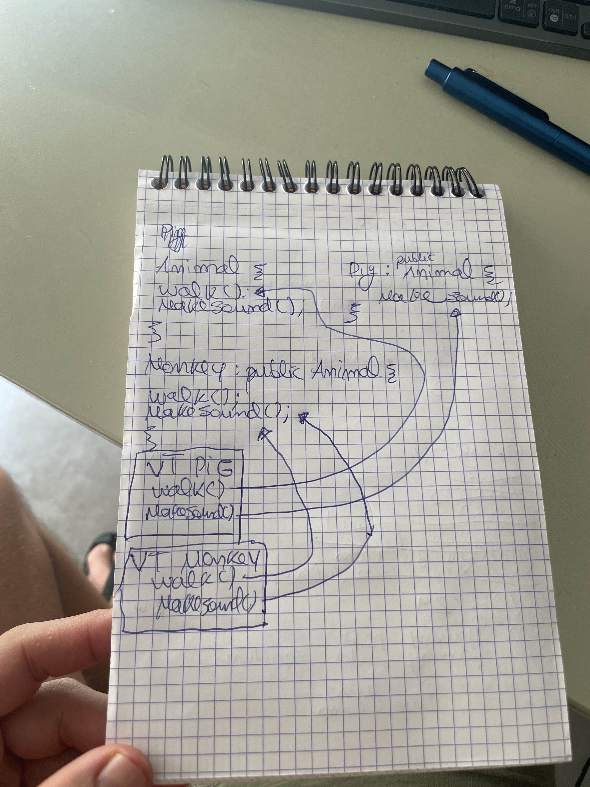

# Dynamic Polymorphism VS Static Polymorphism
- We have a overloading of methods in the same class in static
- With dynamic we use virtual that we can later override in a method that uses this (thats why it is dynamic because the appropriate method to run is determined at `runtime`)
- [Exercises](./exercises/)
## About classes
- `virtual` means that a function within that class can be overrided
- Classes that have pure virtual methods cannot be instantiated ex: `virtual void print() = 0;`
- Classes that are inheriting abstract classes (classes with pure virtual methods) should override the pure virtual methods otherwise cannot be instantiated
- Classes cannot override by overloading methods (make a override where the name of the function is the same but the args are different), override only with the exact same signature
## VTABLES
- What the compiler constructs based on what is reacheable by him for a given class

## Avoiding the diamond problem
- To avoid a diamond problem we should use the keyword `virtual` for the class we are using to inherit, we will do a example in the exercises section
- This virtual does not prevent `ambiguity` but it does prevent a method that is present on the parent to be duplicated (because the childs that the grandchild inherits ihnerit the Parent)
- To effectively solve this ambiguity we must override those methods and specify which one we which to use or give a new implementation
## Private, protected and public
### In a normal class
- public
  - Acessed anywhere
- protected
  - Acessed within the class and by derived class
- private
  - Acessible within the class itself
### Base class 
- public
  - Can be accessed in everything by its childs and who uses its class
- protected
  - Can only be accessed by the derived class
- private
  - Childs cannot access its data
### Child class
- public
    - From outside everything is acessible
    - The grandchild can also access
- protected
  - From outside is not accessible
  - The grandchild can also access
- private
  - from outside is not accessible
  - The grandchild cannot access