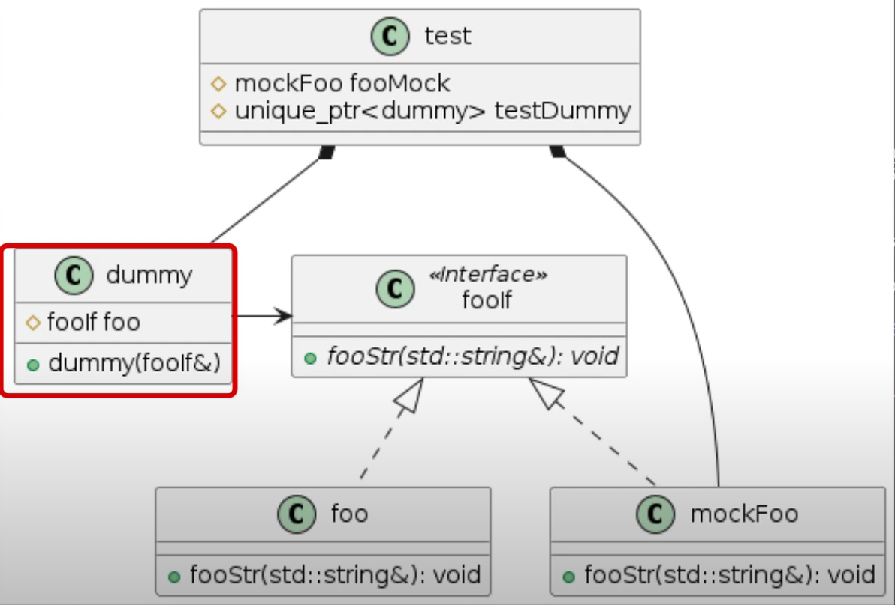

# Info
- To achieve TDD the standard way in CPP is to use C++,cmake and GoogleTest
# Install GoogleTest
- We must clone their repository at a given version i will clone the version 1.15.2
```
git clone git@github.com:google/googletest.git -b v1.15.2
```
- `-b` is actually the trigger to select a given tag
- Now we must create a directory called `build`
- Change our directory to build and then run `cmake ..`
- This will build the build files inside of build
- After we will run `make`
# SIMPLE USAGE OF THIS LIBRARY
- After we will create a example of a test file and compile it including the file headers that we need (libgtest.a)
- `g++ example.cpp googletest/build/lib/libgtest.a -lpthread -I googletest/googletest/include/`
- the .a files are static libraries used in the program if we use them there
- the -lpthread -I is to ensure that we are using some libraries of googletest to ensure multithreading functionalities
- After this we can simply run the output file which is a executable `./a.out` and we can see how our test is
# SIMPLE USAGE OF CMAKE
- We create `CMakeLists.txt`(standard name) 
- We will comment the configs there
- After configuration we can build using `cmake (path of the cmakefile)`
- Then we should run `make` on the directory that we have generated the make files with cmake
- In this case because the project is called `ExampleGtest`, the tests got compiled to a executable ExampleGtest
- If we run `./ExampleGtest` then the tests get done
## NOTES
- We supposely have different threads per operative system
- win32 threads are threads for windows
- pthreads are threads for linux (posix threads)
- But this is not very important for C++ but por the cmake
- Instead of downloading the googletest and building it we can use a functionality called `FetchContent_Declare` from CMAKE, that will use the github project to get those dependencies out of the box
  - [Example](./cmakeFilesExamples/cmakesimplerway/CMakeLists.txt)
  - The git tag appears on the url of the tag when we click in it
- To test new cMakeLists files:
  - make clean
  - rm CMakeCache.txt
- With this we dont need the googletest github anymore
- If we include some things in the cmake file we dont even need the main function in the test file (we will comment it to remember what we need for it to work)
-  `unit testing` is the smallest part of the code that can be tested
# SECOND PART OF THE TUTORIAL (MOCK)
- We are not creating 3 directories
  - src (for cpp files)
  - include (for headers)
    - We will also add this directory to the cmake file
  - test (for the test files themselfs)

- We will create mocks using this classes
- Usually when we want to mock something we use its interface
- He refers to dependency injection as passing a object/initing the object in the constructor
- We are creating a `dummy.hpp` file in the include directory to create a interface for dummy there and we will implement it in the src
- We are also creating a interface for foo interface
- Then we just create a foo src file with a actual method inside
- After we create a mock for the foo where the comments are there for you to understand how we actually mocked it 
- If everything goes right we should have a mock on our tests
- Firstly it will return 0 when we call that method because we are not saying that we wish to return from the mock
- We will use the keyword `EXPECT_CALL`
- Resumed we create loosely coupled components because we effectively created a interface, this interface is implemented in a real object and also in the mock
- We create a pointer of the type of the interface so we can either pass a real object or the mock object
- Ofc for the test we pass the mock one
## Notes
- Its generally good to create interfaces of objects in h/hpp files
- cpp files are its implementation
- In this part of the tutorial we are creating a build file and we will build inside of it by changing directory to it, cmake .. and then make
  - We must delete the cache file and use make delete in order to build inside of the new directory
- In the cMakeLists we added a new executable generated file using the dummy and testDummy
- Also we added to link once again the libraries for the tests have a main (dont forget to use the same name as the binary to link the projects out)
- Our object that we will pass to make the test we will not pass a true object we will pass a mock of it
- By levering interfaces we can pass either a mock of the object or the object itself in the constructor / on dependency injection
- We also have tools that we can add to cmake like `lcov` to check code coverage report